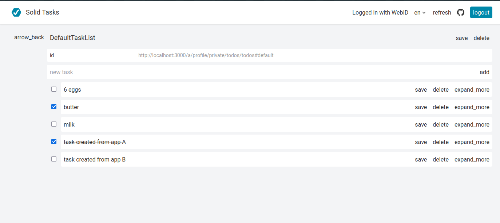
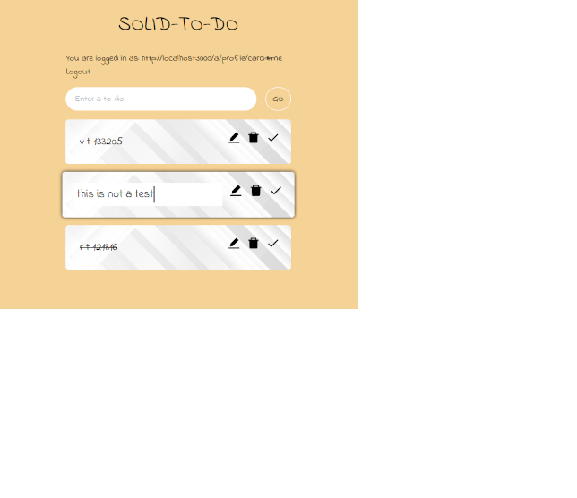

## Basic Demo Walkthrough

The React app and Vue app are todo applications that manage and store user's todos in their Solid Pods. 
When opening the applications, they ask the user to authenticate themselves with their WebIDs 
via the [Solid OIDC](cite:cites spec:oidc) protocol.
After logging in, if the name of the user is found (via a SPARQL SELECT query) it will be shown,
otherwise it will simply display the WebID of the user. 

Both apps provide a textbox for users to enter their todo entries.
These todo entries have a message, date of creation and the status as 'pending' assigned while storing them to the Pod. 
The stored todos can be modified, then an additional date of modification is added as well. 
The todos can be toggled as pending or completed, which will be updated in the Pod. 
Using SPARQL SELECT queries, the stored todos are read from the Pod and displayed in the applications. 
Todo's can be deleted via SPARQL DELETE queries, which removes all the associated information from the Pod.
<figure id="figure-vue" >

<figcaption markdown="block">
Vue-based Todo app
</figcaption>
</figure>
<figure id="figure-react" >

<figcaption markdown="block">
React-based Todo app
</figcaption>
</figure>

{:.comment data-author="RT"}
Something goes wrong with the scaling of the figures in the HTML view of the paper.

 and  show examples of the user interface of the Vue and React-based Todo apps.
In these examples, the same user is logged in, showing the same Todo lists.
If new todo's are added, modified, toggled, or deleted in one app, they will also be reflected in the other app.
