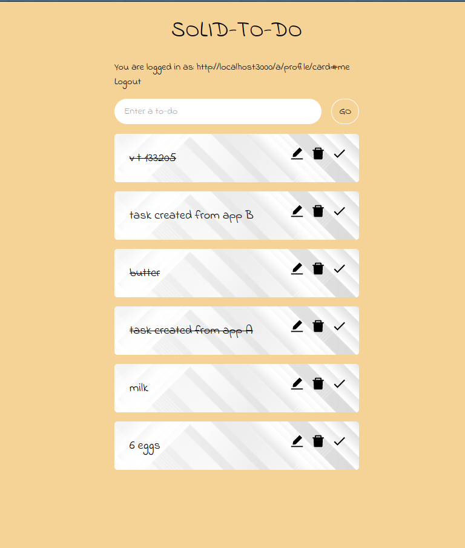

## Basic Demo Walkthrough

Our demo shows how a user can use either of our two separate applications to manage todos in  the Pod. 
Both applications interoperate and allow basic CRUD operations - tasks can be displayed, added, deleted, toggled and edited. 
These operations reflect on the underlying data in the Pod and mirror in the other app .
That means adding, editing or deleting a task in React app will also be shown in Vue app, and vice-versa, as they use the same ontology.

Users with the valid Solid Pods have an associated WebId.
The two todo applications ask the user to use their WebIDs to authorize to interact with the app data in the Pods. 

It is therefore recommended to test the apps with a local version of the CSS[^3] instead _[I don't like to write this -- the server is annoying to set up. Also, should we say something about the CSS/NSS/ESS logins? And should we give a test repo for people to set it up themselves?]_.
{:.comment data-author="Jonas"}

<figure id="figure-main">

<figcaption markdown="block">
Screenshots of React App and Vue App
</figcaption>
</figure>

Both the apps have Login button which use [Solid OIDC](cite:cites spec:oidc) along with WebID for authentication. 
As you can see in the Figure 1, after logging in, the apps display the name of the user if it is found in their root document else it will simply display the WebID of the user. 
Once a user is logged in, the state persists even after a refresh. 
The apps provide a textbox for users to enter their todo entries.
These todo entries have an id, date of creation and the status as 'pending' assigned while storing them to the Pod. 
The stored todos can be modified, then an additional date of modification is added as well. 
The todos can be toggled as pending or completed, which will be updated in the Pod. 
Using Comunica with SPARQL SELECT queries, the stored todos are read from the Pod and displayed in the applications. 
Finally, the todos can be deleted which removes all the associated information from the Pod. This will be reflected in the apps as well.